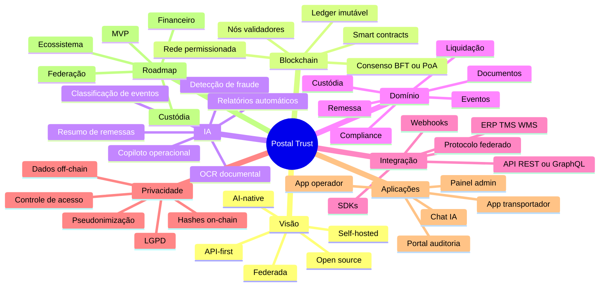
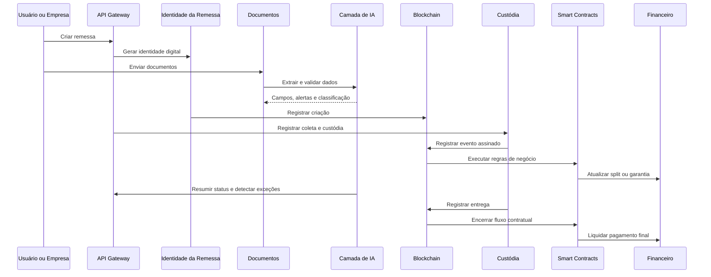

# Obsidian Brain do Projeto

Este arquivo foi pensado para visualização no Obsidian com Mermaid. Ele mostra os principais blocos do sistema e como eles se comunicam.

## Mindmap Geral

## Mapa de Comunicação Entre Blocos

## Fluxo Operacional Resumido

## Leitura Rápida dos Blocos

- `Identidade da Remessa`: cria o ativo digital e o identificador físico.
- `Blockchain de Eventos`: guarda a trilha imutável principal.
- `Custódia e Provas`: registra a responsabilidade por etapa.
- `Smart Contracts`: executa regras de negócio e automação.
- `Documentos e Evidências`: guarda anexos off-chain e hashes on-chain.
- `Financeiro e Liquidação`: gerencia split, escrow e repasses.
- `Risco, Fraude e Compliance`: monitora integridade e políticas.
- `API e Protocolo Aberto`: conecta sistemas internos e outras instâncias.
- `Camada de IA Nativa`: apoia todos os blocos com leitura, análise e automação.
- `Privacidade e LGPD`: garante minimização, pseudonimização e controle de acesso.
- `Federação entre Instâncias`: permite interoperabilidade entre empresas.
