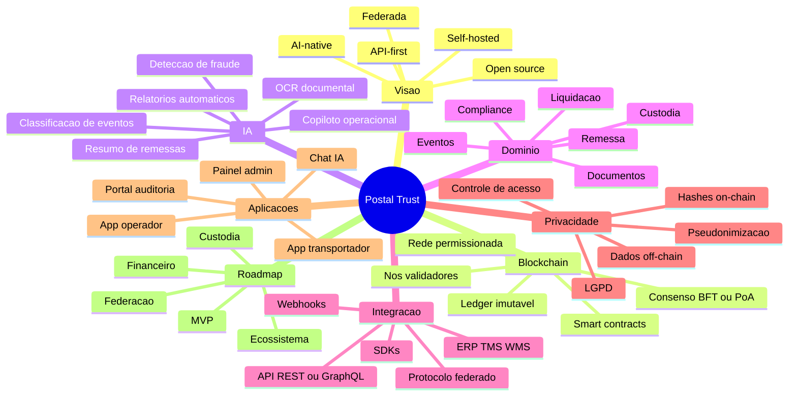
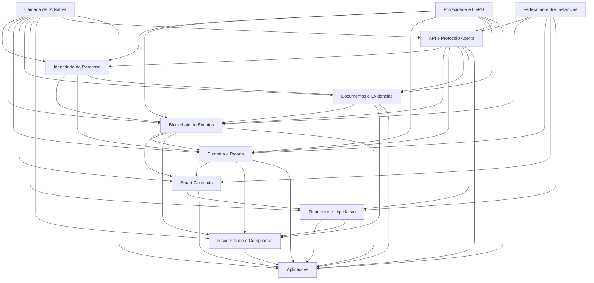

# Obsidian Brain do Projeto

Este arquivo foi pensado para visualizacao no Obsidian com Mermaid. Ele mostra os principais blocos do sistema e como eles se comunicam.

## Mindmap Geral

## Mapa de Comunicacao Entre Blocos

## Fluxo Operacional Resumido

## Leitura Rapida dos Blocos

- `Identidade da Remessa`: cria o ativo digital e o identificador fisico.
- `Blockchain de Eventos`: guarda a trilha imutavel principal.
- `Custodia e Provas`: registra a responsabilidade por etapa.
- `Smart Contracts`: executa regras de negocio e automacao.
- `Documentos e Evidencias`: guarda anexos off-chain e hashes on-chain.
- `Financeiro e Liquidacao`: gerencia split, escrow e repasses.
- `Risco, Fraude e Compliance`: monitora integridade e politicas.
- `API e Protocolo Aberto`: conecta sistemas internos e outras instancias.
- `Camada de IA Nativa`: apoia todos os blocos com leitura, analise e automacao.
- `Privacidade e LGPD`: garante minimizacao, pseudonimizacao e controle de acesso.
- `Federacao entre Instancias`: permite interoperabilidade entre empresas.
