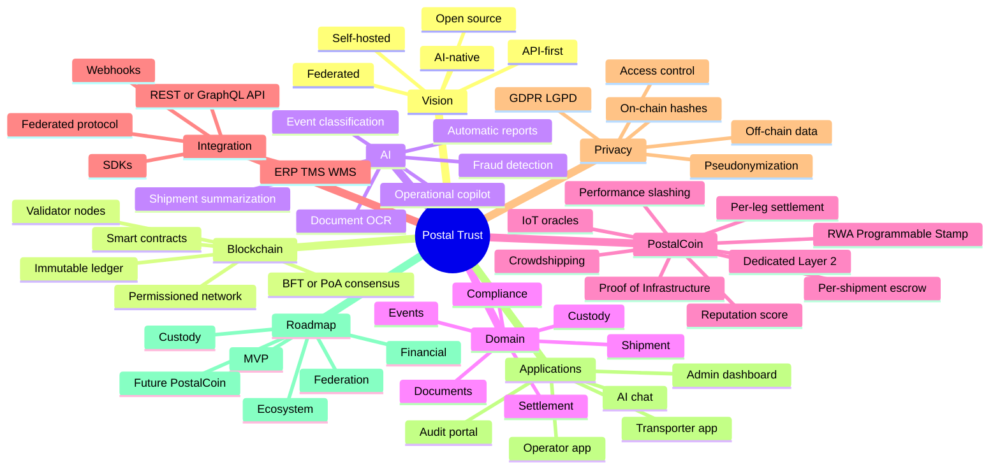
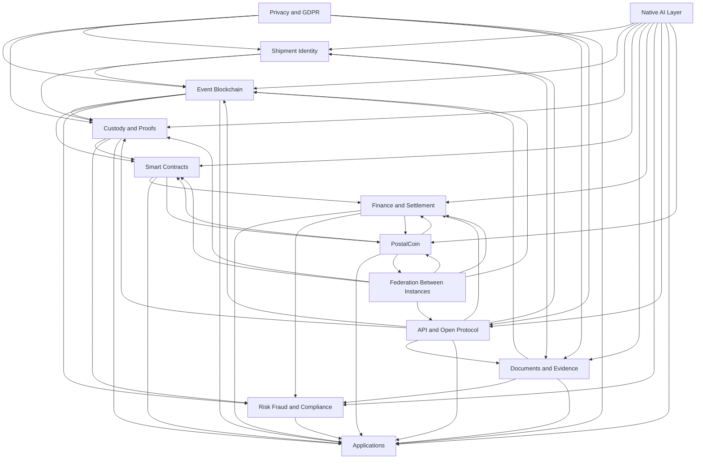
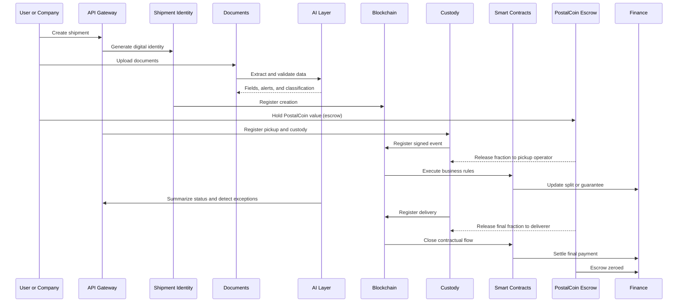

# Project Obsidian Brain

This file is designed for visualization in Obsidian with Mermaid. It shows the main system blocks and how they communicate.

## General Mindmap

## Block Communication Map

## Summarized Operational Flow

## Quick Block Reference

- `Shipment Identity`: creates the digital asset and readable physical identifier.
- `Event Blockchain`: stores the immutable main trail.
- `Custody and Proofs`: records responsibility at each stage.
- `Smart Contracts`: executes business rules and automation.
- `Documents and Evidence`: stores off-chain attachments and on-chain hashes.
- `Finance and Settlement`: manages splits, escrow, and payments.
- `Risk, Fraud and Compliance`: monitors integrity and policies.
- `API and Open Protocol`: connects internal systems and other instances.
- `Native AI Layer`: supports all blocks with reading, analysis, and automation.
- `Privacy and GDPR`: ensures minimization, pseudonymization, and access control.
- `Federation Between Instances`: enables interoperability between companies.
- `PostalCoin`: programmable economic layer — the Programmable Stamp (RWA). Issuance via Proof of Infrastructure, automatic per-leg settlement, incentivized crowdshipping, performance slashing, and reputation scoring. Future ecosystem evolution.
