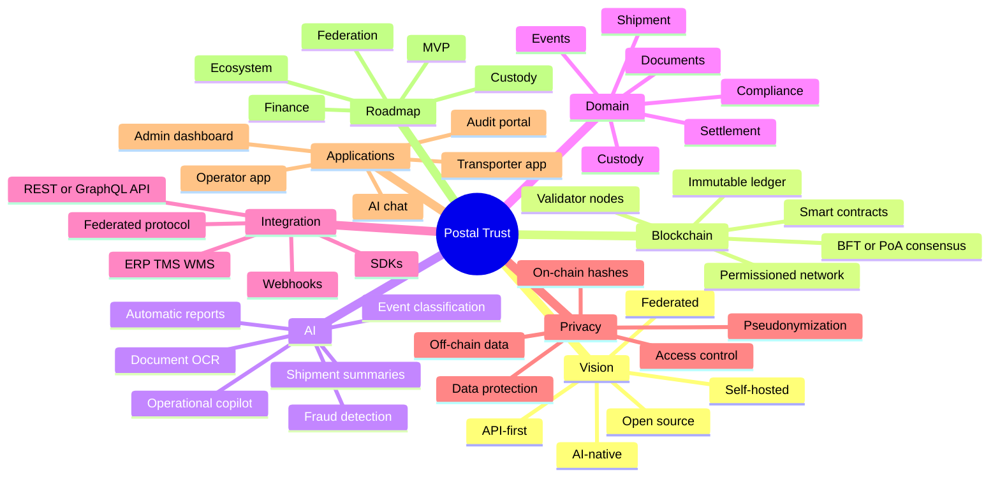
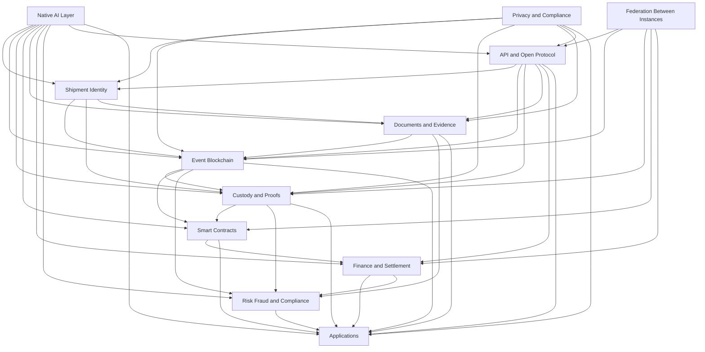
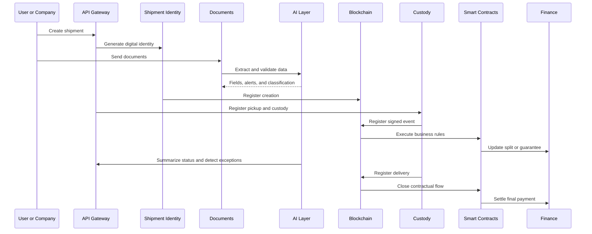

# Obsidian Brain

This file was designed for visualization in Obsidian using Mermaid. It shows the main system blocks and how they communicate.

## General Mindmap

## Communication Map Between Blocks

## High-Level Operational Flow

## Quick Reading of the Blocks

- `Shipment Identity`: creates the digital asset and physical identifier.
- `Event Blockchain`: stores the main immutable trail.
- `Custody and Proofs`: records responsibility at each stage.
- `Smart Contracts`: executes business rules and automation.
- `Documents and Evidence`: stores off-chain attachments and on-chain hashes.
- `Finance and Settlement`: manages splits, escrow, and payouts.
- `Risk, Fraud, and Compliance`: monitors integrity and policy adherence.
- `API and Open Protocol`: connects internal systems and external instances.
- `Native AI Layer`: supports all blocks with reading, analysis, and automation.
- `Privacy and Compliance`: ensures minimization, pseudonymization, and access control.
- `Federation Between Instances`: enables interoperability between companies.
